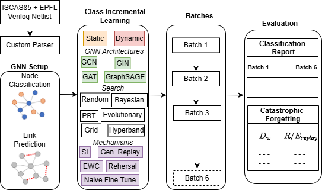

# Class Incremental Learning for Circuits

This repository implements Class Incremental Learning (CIL) for Graph Neural Networks (GNNs) applied to circuits. It includes modular code for both **node classification** and **link prediction**, across **static** and **dynamic** GNN architectural settings, with detailed tracking of **catastrophic forgetting metrics**.

---

  

## 📁 Repository Structure

### 🔄 Parsing Script
- **ISCAS85+EPFL_Parsing.ipynb**  
  Located at the root, this Jupyter notebook parses benchmark datasets (ISCAS85 and EPFL) into graph formats suitable for GNN training. Get those dataset from `https://github.com/jpsety/verilog_benchmark_circuits` and keep it in a folder. Put such folder parth in the parsing script and follow through the notebook cells. 

---

### 🧠 Node Classification Modules
Each GNN architecture has a dedicated folder for node classification:
- `GCN_node_classification`
- `GAT_node_classification`
- `GIN_node_classification`
- `GraphSAGE_node_classification`

Each folder contains:
- Python scripts for training and evaluation under **static** and **dynamic** settings.
- Jupyter notebooks that visualize batch-wise accuracy and catastrophic forgetting metrics `<GNN name>_node_classification_CF.ipynb`.
- Output files generated by running the notebooks, preserving results for reproducibility and comparison.

---

### 🔗 Link Prediction Modules
Each GNN architecture also has a separate folder for link prediction:
- `GCN_link_prediction`
- `GAT_link_prediction`
- `GIN_link_prediction`
- `GraphSAGE_link_prediction`

Each folder includes:
- Scripts tailored for link prediction tasks under both **static** and **dynamic** CIL settings.
- Jupyter notebooks for visualizing performance trends and metric evolution.
- Catastrophic forgetting metric visualization across static and dynamic GNNs in CIL in `<GNN name>_link_prediction_CF.ipynb`
- Generated output files from notebook runs, maintaining separation between node vs link tasks.

---

## 🧩 Static vs Dynamic Settings
- **Static**: Fixed architecture across batches; used to benchmark stability and forgetting.
- **Dynamic**: Expanding architecture at the output layer of each GNN to accommodate new classes; used to study parameter drift and instability.

Each setting is implemented separately within the respective GNN folders, with clear naming conventions and isolated outputs to avoid cross-contamination. Also, each jupyter notebook is well annotated with the context and brief description of the code.

---

## 📊 Catastrophic Forgetting Metrics
All experiments track:
- Accuracy degradation/improvement across batches.
- Weight distance metrics.
- Mechanism-specific regularization metrics (e.g., EWC, SI, Replay).

These metrics are computed and visualized in the Jupyter notebooks `<GNN name>_node_classification_CF.ipynb` and `<GNN name>_link_prediction_CF.ipynb` inside each folder, with results saved per folder to maintain clarity between mechanisms and tasks.

---

## 📘 How to Use
1. Start with `ISCAS85+EPFL_Parsing.ipynb` to prepare datasets.
2. Choose a GNN folder based on task (node classification or link prediction) and architecture.
3. Run the Jupyter notebook inside the folder to execute experiments and view results.
4. Compare static vs dynamic performance and analyze catastrophic forgetting using the saved metrics.

---

## 🧪 FCN-MNIST: Toy Example for CIL

To help readers unfamiliar with Graph Neural Networks (GNNs), this repository includes a toy example using a **Fully Connected Network (FCN)** on the **MNIST digit image dataset**. This example is located in the `FCN_MNIST` folder.

- It uses a **static architecture** to simulate **class incremental learning** by introducing digit classes (0–9) incrementally across batches.
- This setup provides a gentle introduction to CIL concepts—such as catastrophic forgetting, batch-wise accuracy tracking, and incremental updates—without requiring prior knowledge of GNNs.
- The code and results are structured similarly to the GNN experiments, making it easy to transition from this toy example to more advanced graph-based tasks.

This example is ideal for readers who want to understand the fundamentals of class incremental learning before diving into circuit-level GNN implementations.

---
## 🧪 Reproducibility
All folders contain:
- Independent scripts and notebooks.
- Generated outputs from prior runs.
- Mechanism-specific configurations and hyperparameters.

This ensures reproducibility and transparency across all experiments.

---

Feel free to explore each folder to understand how different GNNs behave under incremental learning for circuit-level tasks.
